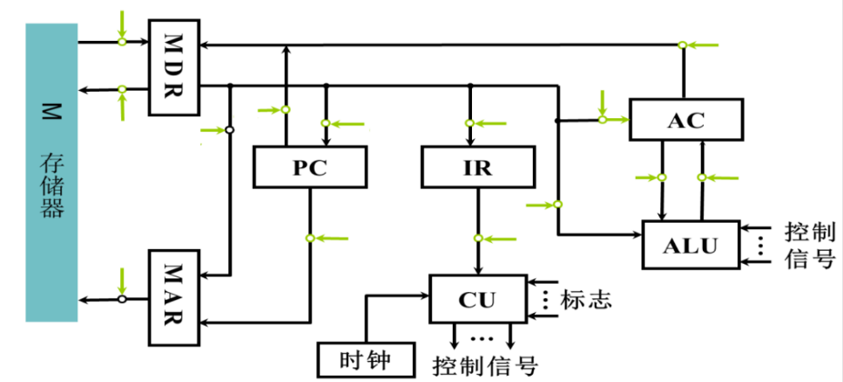

# 作业三

## 第一题

假设某型机的 CPU 指令周期有五个功能段，分别为取指令 IF、译码并读寄存器 ID、执行指令 EX、存储器访问（MEM）、将结果存回寄存器 WB。流水线中各段的执行时间分别是 4ns、5ns、6ns、7ns、4ns。若该机使用流水线执行 200 条指令，假设不存在冲突问题，试问：

### (1) 流水线的最大吞吐率是多少？

### (2) 该流水线执行完成 200 条指令需要多长时间？

### (3) 执行完成 200 条指令，该流水线的效率为多少？

### (4) 如果流水线执行下列指令序列是否存在相关？存在什么相关？

```
MUL R2, R1, R0  ; (R1)×(R0)→R2
JEQ X           ; 乘法结果为零则转移
ADD R3, R4, R5  ; (R4)+(R5)→R3
```

---

## 第二题

假设 CPU 采用非总线结构（如下图所示），微程序设计中每个机器周期执行一条微指令（每个机器周期包含 3 个节拍）。请完成以下任务：

### (1) 写出取指阶段的微操作及节拍安排。

### (2) 写出下列指令执行阶段的微操作及节拍安排：

- **STA X**：将累加器 ACC 的数据写入主存 X 地址单元
- **AND X**：将主存 X 地址单元的数据与累加器 ACC 的数据按位与，结果送 ACC
- **ADD \#a**：将立即数 a 与累加器 ACC 的数据相加，结果送 ACC


